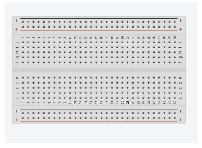
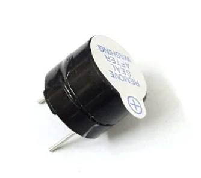

##  THỰC HIỆN
### 1. Danh sách linh kiện điện tử:
| Tên linh kiện | Số lượng | Giá | Nguồn | 
| ------------- | :------: | --- | ------|
| Adruino UNO R3|    1     | 125000VND | [Link](https://hshop.vn/products/arduino-uno-r3) |
| BreadBoard |    1     | 16000VND | [Link](https://hshop.vn/products/test-board-camnho-8-5-x-5-5-cm) |
| Jumper Wire |    1     | 32000VND | [Link](https://hshop.vn/products/day-camtest-board-duc-coi30cm40soi) |
| Resistance |    1     | 5000VND | [Link](https://hshop.vn/products/bo-30-loai-dien-tro-1-4w-1-thong-dung-10-1m-ohm-30-kind-1-4w-resistance) |
| Button |    1     | 8000VND | [Link](https://shopee.vn/N%C3%BAt-nh%E1%BA%A5n-4-ch%C3%A2n-6x6x5-6-7-8-9-10-12-14-15-17mm-ti%E1%BA%BFp-%C4%91i%E1%BB%83m-%C4%91%E1%BB%93ng.-i.67030960.13887875044?sp_atk=8653fee1-dd1d-4b89-8898-8111d3b1eba5&xptdk=8653fee1-dd1d-4b89-8898-8111d3b1eba5) |
| Temperature & Humidnity sensor |    1     | 101000VND | [Link](https://hshop.vn/products/grove-temperature-humidity-sensor-dht11-cam-bien-nhiet-do-do-am) |
| Relay |    1     | 10000VND | [Link](https://hshop.vn/products/module-1-relay-5vdc-ky-019) |
| HC-06 Bluetooth Module |    1     | 85000VND | [Link](https://hshop.vn/products/mach-thu-phat-bluetooth-hc-06-chua-ra-chon-slave) |
| Pir Motion Sensor |    1     | 103000VND | [Link](https://hshop.vn/products/grove-digital-pir-motion-sensor-12m-cam-bien-nhiet-chuyen-dong) |
| Laser Module |    2     | 8000VND | [Link](https://hshop.vn/products/module-laser-5v) |
| Wi-fi module |    1     | 48000VND | [Link](https://hshop.vn/products/mach-thu-phat-wifi-esp8266-v1) |
| Camera module |    1     | 43000VND | [Link](https://hshop.vn/products/mach-camera-ov7670) |
| Step Motor |    1     | 55000VND | [Link](https://hshop.vn/products/dong-co-buoc-size-42mm-nema-17-stepper-motor-4234) |
| Mini Water Pump |    1     | 12000VND | [Link](https://hshop.vn/products/dong-co-bom-chim-mini-5vdc) |
### 2. Hình ảnh các linh kiện:
<!-- 
 -->
  
   
### 3. Kế hoạch tổng quan thực hiện công việc:
#### Tổng quan kế hoạch: 
Dự án sẽ được thực hiện trong vòng 8 tuần, bao gồm các giai đoạn sau:
* Chuẩn bị và thu thập linh kiện
* Thiết kế và xây dựng mạch
* Lập trình và tích hợp hệ thống
* Kiểm tra và hoàn thiện sản phẩm
* Viết báo cáo và chuẩn bị bài thuyết trình
#### Bảng phân công chi tiết công việc:
| Họ và tên     |   MSSV   |      Công việc   | Thời gian | 
| ------------- | :------: | --------------------- | --------- |
| Lê Thanh Tâm  | 22127374 | Thiết kế sơ đồ mạch điện      | 21:00:00 18/07/2024 | 
| Lưu Thanh Thúy| 22127410 | Lắp ráp mạch trên Breadboard  | 21:00:00 18/07/2024 | 
| Lê Thanh Tâm  | 22127374 | Lập trình Adruino             | 21:00:00 18/07/2024 | 
| Lưu Thanh Thúy| 22127410 | Tích hợp Bluetooth và Wi-fi module  | 21:00:00 18/07/2024 | 
| Lê Thanh Tâm  | 22127374 | Kiểm tra hệ thống      | 21:00:00 18/07/2024 | 
| Lưu Thanh Thúy| 22127410 | Thiết kế 3D | 21:00:00 18/07/2024 | 
| Lê Thanh Tâm  | 22127374 | Lưu trữ dữ liệu cảm biến lên cloud  | 21:00:00 18/07/2024 | 
| Lưu Thanh Thúy| 22127410 | Có thể xem lịch sử dữ liệu đã lưu trên cloud trên giao diện web  | 21:00:00 18/07/2024 | 
| Lê Thanh Tâm  | 22127374 | Có thể thông báo về điện thoại bằng thông báo nhanh     | 21:00:00 18/07/2024 | 
| Lưu Thanh Thúy| 22127410 | Có thể thông báo cho người dùng bằng gmail  | 21:00:00 18/07/2024 | 
| Lê Thanh Tâm  | 22127374 | Có giao diện web cho phép đăng ký tài khoản (ghi thành công thông tin tài khoản vào database/cloud/file)  | 21:00:00 18/07/2024 | 
| Lưu Thanh Thúy| 22127410 | Có giao diện web cho phép đăng nhập hệ thống (đọc thành công thông tin tài khoản đăng nhập từ database/cloud/file) | 21:00:00 18/07/2024 | 

