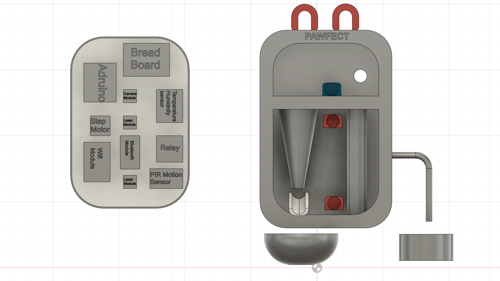

## Thiết kế hình dáng 3D của sản phẩm

Đồ án sử dụng phần mềm **Autodesk Fusion 360** để hỗ trợ xây dựng bản thiết kế 3D cho sản phẩm. 

* **Arduino**: Đơn vị điều khiển trung tâm của thiết bị.
* **Bread Board**: Bảng mạch để kết nối các module và linh kiện điện tử.
* **Các module cảm biến:**
    + **Cảm biến Camera:** Để giám sát và chụp hình thú cưng.
    + **Cảm biến Nhiệt độ và Độ ẩm:** Để theo dõi môi trường xung quanh thú cưng.
    + **Cảm biến Chuyển động PIR:** Để phát hiện chuyển động của thú cưng.
* **Module Laser:** Hai module laser để tạo điểm sáng chơi cho thú cưng.
* **Các module kết nối:**
    + **Module Wifi:** Để kết nối thiết bị với mạng internet.
    + **Module Bluetooth:** Để kết nối thiết bị với điện thoại hoặc thiết bị khác qua Bluetooth.
* **Relay:** Để điều khiển các thiết bị điện khác.
* **Động cơ bước (Step Motor):** Để điều khiển các bộ phận cơ học trong thiết bị.

* **Phễu thức ăn**: Dùng để chứa và phân phối thức ăn cho thú cưng.
* **Cổng nước**: Được kết nối để cung cấp nước cho thú cưng.
* **Các nút điều khiển**: Có một nút màu xanh và một nút màu đỏ để điều khiển các chức năng của thiết bị.

## Thiết kế giao diện website

Đồ án sử dụng công nghệ **ReactJS** để hỗ trợ xây dựng website cho sản phẩm. Người dùng phải đăng nhập tài khoản trước khi sử dụng.

Nếu chưa có tài khoản, có thể đăng kí bằng cá234ch nhấn vào **Log in** ở dưới. Giao diện đăng kí người dùng như sau:

Sau khi đăng nhập thành công, màn hình **dashboard** hiện lên với đầy đủ các thông tin giúp người dùng nắm được lượng thức ăn và nước vật nuôi tiêu thụ trong theo thời gian, nhiệt độ độ ẩm trong phòng thời điểm hiện tại, đồng thời cả video phát trực tiếp theo dõi thú cưng. Với mỗi đầu mục ở thanh SideBar, sẽ là chức năng tương ứng.

## Thiết kế sơ đồ truyền và nhận dữ liệu của các thành phần trong hệ thống

