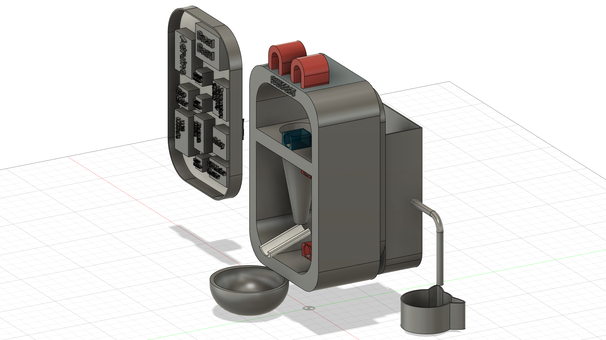
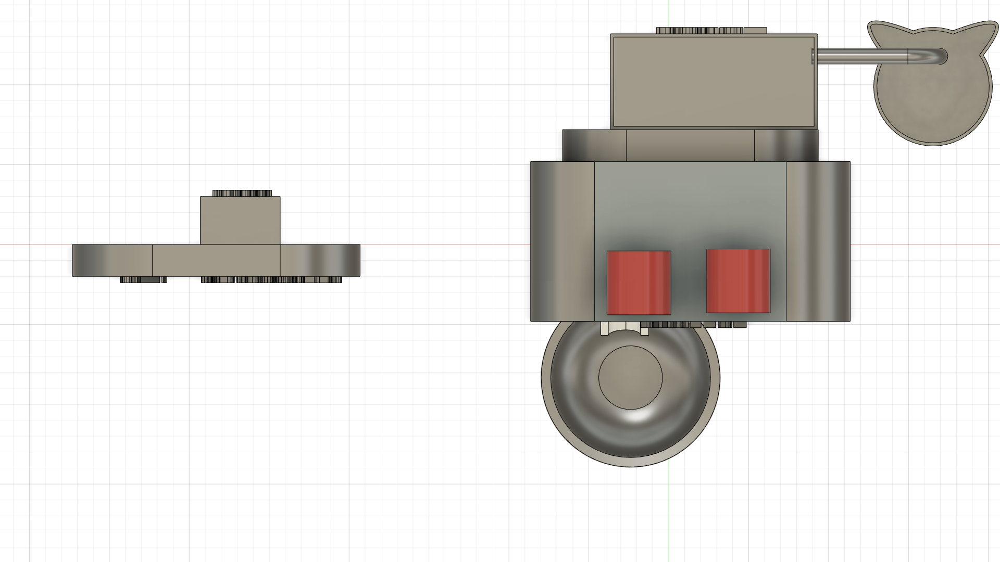

# THIẾT KẾ

## Thiết kế hình dáng 3D của sản phẩm

Đồ án sử dụng phần mềm **Autodesk Fusion 360** để hỗ trợ xây dựng bản thiết kế 3D cho sản phẩm. 

**Mô tả sơ lược thiết kế:**
* **Ống chứa:** Với thanh ống dài kế phễu và 2 tia laser, sẽ là nơi chứa các đường dây kết nối lại với nhau, được nối với bo mạch từ ngoài sau.
* **Phễu thức ăn**: Dùng để chứa và phân phối thức ăn cho thú cưng. Bên trong chiếc phễu, ***Step Motor*** sẽ đính với 1 miếng nhựa hình tròn nằm ngang, có diện tích bằng diện tích đường tròn tại vị trí đâm đầu dẫn của ***Step Motor*** vào phễu. Đây sẽ là công tắc giúp đẩy đồ ăn xuống và chặn đồ ăn lại.  
* ***Cổng nước**: Được kết nối để cung cấp nước cho thú cưng. Bên trong thùng nước sẽ có một ***Water Pump*** kết hợp với sự điều khiển ***Relay*** đẩy nước từ trong thùng ra ngoài chén nước cho thú cưng. 

\pagebreak

## Thiết kế giao diện website

Đồ án sử dụng công nghệ **ReactJS** để hỗ trợ xây dựng website cho sản phẩm. Người dùng phải đăng nhập tài khoản trước khi sử dụng.

Nếu chưa có tài khoản, có thể đăng kí bằng cá234ch nhấn vào **Log in** ở dưới. Giao diện đăng kí người dùng như sau:

Sau khi đăng nhập thành công, màn hình **dashboard** hiện lên với đầy đủ các thông tin giúp người dùng nắm được lượng thức ăn và nước vật nuôi tiêu thụ trong theo thời gian, nhiệt độ độ ẩm trong phòng thời điểm hiện tại, đồng thời cả video phát trực tiếp theo dõi thú cưng. Với mỗi đầu mục ở thanh SideBar, sẽ là chức năng tương ứng.

## Thiết kế sơ đồ truyền và nhận dữ liệu của các thành phần trong hệ thống

