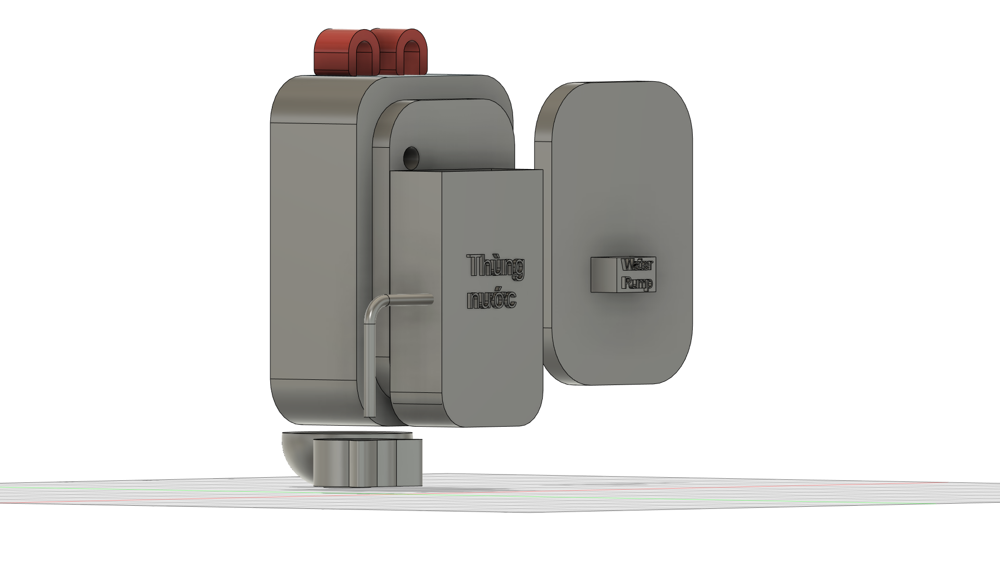
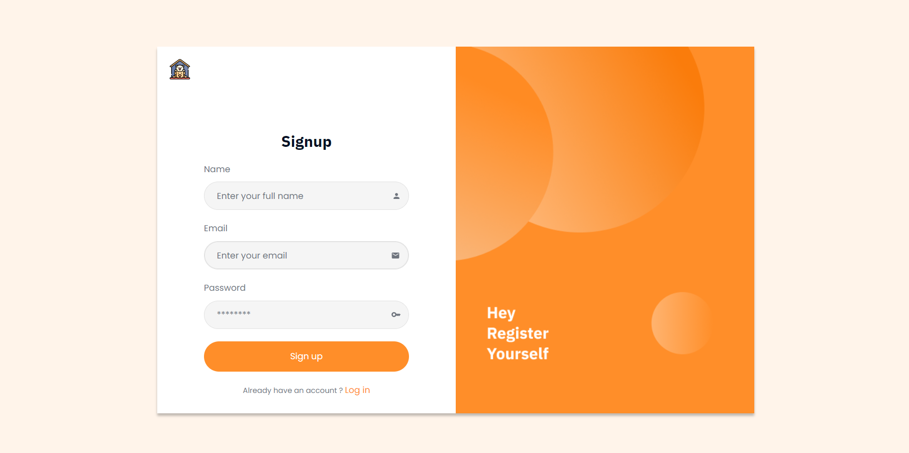

## Thiết kế hình dáng 3D của sản phẩm

Đồ án sử dụng phần mềm **Autodesk Fusion 360** để hỗ trợ xây dựng bản thiết kế 3D cho sản phẩm. 

## Thiết kế giao diện website

Đồ án sử dụng công nghệ **ReactJS** để hỗ trợ xây dựng website cho sản phẩm. Người dùng phải đăng nhập tài khoản trước khi sử dụng.

Nếu chưa có tài khoản, có thể đăng kí bằng cách nhấn vào **Log in** ở dưới. Giao diện đăng kí người dùng như sau:

Sau khi đăng nhập thành công, màn hình **dashboard** hiện lên với đầy đủ các thông tin giúp người dùng nắm được lượng thức ăn và nước vật nuôi tiêu thụ trong theo thời gian, nhiệt độ độ ẩm trong phòng thời điểm hiện tại, đồng thời cả video phát trực tiếp theo dõi thú cưng. Với mỗi đầu mục ở thanh SideBar, sẽ là chức năng tương ứng.

## Thiết kế sơ đồ truyền và nhận dữ liệu của các thành phần trong hệ thống

