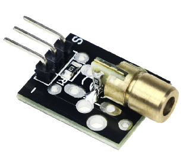

# THỰC HIỆN

## Danh sách linh kiện điện tử:

| Tên linh kiện                  | Số lượng | Giá        | Hình ảnh                | Nguồn                                                                    | 
| ---------------- | :------: | --------------- | ------------------------- | --------|
| Adruino UNO R3                 |    1     | 125.000VND |      | [HShop](https://hshop.vn/products/arduino-uno-r3)                                                          |
| BreadBoard                     |    1     | 16.000VND  |   | [HShop](https://hshop.vn/products/test-board-camnho-8-5-x-5-5-cm)                                          |
| Jumper Wire                    |    1     | 32.000VND  |       | [HShop](https://hshop.vn/products/day-camtest-board-duc-coi30cm40soi)                                      |
| Resistance                     |    1     | 5.000VND   |   | [HShop](https://hshop.vn/products/bo-30-loai-dien-tro-1-4w-1-thong-dung-10-1m-ohm-30-kind-1-4w-resistance) |
| Buzzer                         |    1     | 3.000VND   |       | [HShop](https://hshop.vn/products/coi-buzzer-5vdc)                                                         |
| Temperature & Humidnity sensor |    1     | 101.000VND |    | [HShop](https://hshop.vn/products/grove-temperature-humidity-sensor-dht11-cam-bien-nhiet-do-do-am)         |
| Relay                          |    1     | 10.000VND  |        | [HShop](https://hshop.vn/products/module-1-relay-5vdc-ky-019)                                              |
| HC-06 Bluetooth Module         |    1     | 85.000VND  |    | [HShop](https://hshop.vn/products/mach-thu-phat-bluetooth-hc-06-chua-ra-chon-slave)                        |
| PIR Motion Sensor              |    1     | 103.000VND |          | [HShop](https://hshop.vn/products/grove-digital-pir-motion-sensor-12m-cam-bien-nhiet-chuyen-dong)          |
| Laser Module                   |    2     | 8.000VND   |        | [HShop](https://hshop.vn/products/module-laser-5v)                                                         |
| Wi-fi module                   |    1     | 48.000VND  |         | [HShop](https://hshop.vn/products/mach-thu-phat-wifi-esp8266-v1)                                           |
| Camera module                  |    1     | 43.000VND  |       | [HShop](https://hshop.vn/products/mach-camera-ov7670)                                                      |
| Step Motor                     |    1     | 55.000VND  |    | [HShop](https://hshop.vn/products/dong-co-buoc-size-42mm-nema-17-stepper-motor-4234)                       |
| Mini Water Pump                |    1     | 12.000VND  |    | [HShop](https://hshop.vn/products/dong-co-bom-chim-mini-5vdc)            
                                  |

\pagebreak

### Kế hoạch tổng quan thực hiện công việc:

1. Tổng quan kế hoạch: 

Dự án sẽ được thực hiện trong vòng 8 tuần, bao gồm các giai đoạn sau:
* Chuẩn bị và thu thập linh kiện
* Thiết kế và xây dựng mạch
* Lập trình và tích hợp hệ thống
* Kiểm tra và hoàn thiện sản phẩm
* Viết báo cáo và chuẩn bị bài thuyết trình

2. Bảng phân công chi tiết công việc:
   
| Họ và tên     |   MSSV   |      Công việc   | Thời gian | 
| ------------- | :------: | --------------------- | --------- |
| Lê Thanh Tâm  | 22127374 | Thiết kế sơ đồ mạch điện      | 21:00:00 18/07/2024 | 
| Lưu Thanh Thúy| 22127410 | Lắp ráp mạch trên Breadboard  | 21:00:00 18/07/2024 | 
| Lê Thanh Tâm  | 22127374 | Lập trình Adruino             | 21:00:00 18/07/2024 | 
| Lưu Thanh Thúy| 22127410 | Tích hợp Bluetooth và Wi-fi module  | 21:00:00 18/07/2024 | 
| Lê Thanh Tâm  | 22127374 | Kiểm tra hệ thống      | 21:00:00 18/07/2024 | 
| Lưu Thanh Thúy| 22127410 | Thiết kế 3D | 21:00:00 18/07/2024 | 
| Lê Thanh Tâm  | 22127374 | Lưu trữ dữ liệu cảm biến lên cloud  | 21:00:00 18/07/2024 | 
| Lưu Thanh Thúy| 22127410 | Có thể xem lịch sử dữ liệu đã lưu trên cloud trên giao diện web  | 21:00:00 18/07/2024 | 
| Lê Thanh Tâm  | 22127374 | Có thể thông báo về điện thoại bằng thông báo nhanh     | 21:00:00 18/07/2024 | 
| Lưu Thanh Thúy| 22127410 | Có thể thông báo cho người dùng bằng gmail  | 21:00:00 18/07/2024 | 
| Lê Thanh Tâm  | 22127374 | Có giao diện web cho phép đăng ký tài khoản (ghi thành công thông tin tài khoản vào database/cloud/file)  | 21:00:00 18/07/2024 | 
| Lưu Thanh Thúy| 22127410 | Có giao diện web cho phép đăng nhập hệ thống (đọc thành công thông tin tài khoản đăng nhập từ database/cloud/file) | 21:00:00 18/07/2024 | 

